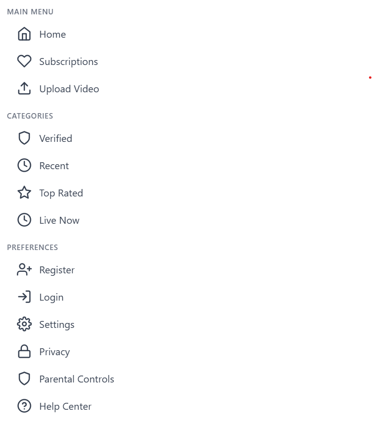

İLK KAYIT OLMASINA GEREK OLMUCAK AMA İNDİR TIKLADIMI BİR KÜÇÜK SAYFA AÇILCAK İNDİRMEK İÇİN KAYIT OLMAN GEREKLI DİCEK KAYIT OL BUTONUA TIKLICAK KAYIT OL TIKLADIMI KAYIT SAYFASINA SONRA İNDİRE BİLCEK PREMİUM İÇERİKLERDE OLUCAK

# KULLANILICAK TEKNELOJİLER 

Next.js
Redux
Node.js
Express.js
MongoDB
Serverless

# SİDEBARMENU
 
 SİDEBARMENU OLARAK BUNU KULLANMAK İSTİYORUM ÇIKARILCAK ŞEYLERİ BİLİYORSUN ZATEN UPLOD VİDEO ABONE ONAYLAMA FALAN

 # ADMİN DASHBOARD

 aynı sizin Düpas admin paneli gibi uploud kısmı olucak kategori seçicem isim eklicem rarı yüklücem sonra uploud edcem sen yüklenenler kısmı olucak en son yüklenen rarlar olucak member kısmı olsun kayıt olan üyelerin e postası ve tokenı gözükcek sonra static kısmı olsun istaistikler orda gözüksün toplam kayıtlar falan
 